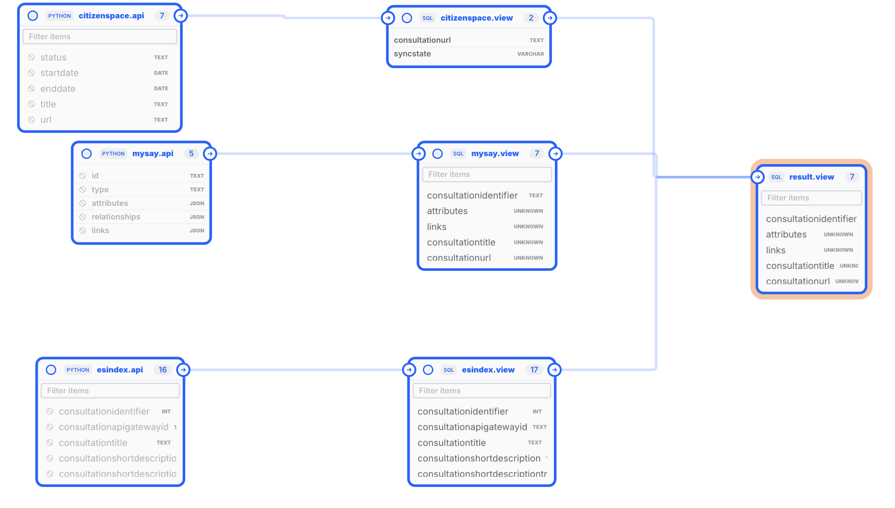

# SQLMesh Data Pipeline for Elasticsearch and Drupal Integration

## Overview

This document outlines a process using SQLMesh to harvest data from external REST APIs, enrich it using seeds, transform and deduplicate it, and store it in Elasticsearch for consumption by a Drupal view on wa.gov.au.

Once opened, you can run `sqlmesh ui` in the cli, and open the resultant port in a browser to edit/debug the pipelines.

## Workflow Diagram

```mermaid
graph TD
    A[External REST APIs] -->|Harvest Data| B[SQLMesh]
    H[SQLMesh Seeds] -->|Enrich Data| B
    B -->|Transform & Deduplicate| C[SQL Processing]
    C -->|Ingest| D[Elasticsearch]
    D -->|Consume| E[Drupal View]
    E -->|Display| F[wa.gov.au Website]
    G[User] -->|Filter| E

```

## Schema Diagram

## Process Steps

1. **Data Harvesting**: Use SQLMesh to connect to and harvest data from external REST APIs.
   - [SQLMesh Python Models](https://sqlmesh.readthedocs.io/en/stable/concepts/models/python_models/)

2. **Data Enrichment with Seeds**: Utilize SQLMesh seeds to enhance the harvested data.
   - [SQLMesh Seeds](https://sqlmesh.readthedocs.io/en/stable/concepts/models/seed_models/)

3. **Transformation and Deduplication**: Leverage SQLMesh's SQL capabilities to process the enriched data.
   - [SQLMesh SQL Models](https://sqlmesh.readthedocs.io/en/stable/concepts/models/sql_models/)

4. **Elasticsearch Ingestion**: Configure SQLMesh to output the processed data to Elasticsearch.
   - [SQLMesh Python Models](https://sqlmesh.readthedocs.io/en/stable/concepts/models/python_models/)

5. **Drupal Integration**: Set up a Drupal view to consume the Elasticsearch index directly, enabling filtering on wa.gov.au.

## Key SQLMesh Concepts

- **Python Models**: Define connections to REST APIs and output to Elasticsearch
- **Seeds**: Provide static data for enrichment
- **Views**: Create SQL transformations

## Notes on SQLMesh Seeds for Data Enrichment

1. **Purpose**: Seeds allow you to incorporate static or slowly changing data into your data pipeline.

2. **Use Cases**:
   - Add metadata to API responses
   - Provide lookup tables for code-to-description mapping
   - Include default values for missing fields

3. **Implementation**: 
   - Define seeds as CSV files or SQL queries
   - Reference seeds in your SQLMesh views to join with API data

For detailed implementation guidance, refer to the [SQLMesh Documentation](https://sqlmesh.com/docs/).